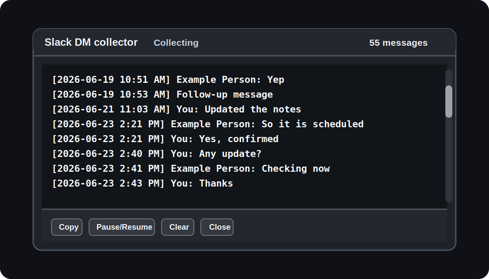

# Slack DM Visible Exporter

A small browser-console helper for collecting visible Slack direct-message history with dates while you scroll.

This is not a Slack API client and it does not bypass Slack permissions. It only reads message elements that your browser has already rendered in the Slack web UI.

## Preview

<p align="center">
  
</p>

## Suggested Repository Name

Recommended:

```text
slack-dm-visible-exporter
```

Other reasonable options:

```text
slack-visible-history-collector
slack-dm-scroll-capture
slack-dm-history-helper
```

## What It Does

Slack does not keep the entire conversation history in the page DOM at once. It renders only the messages around the current scroll position.

This script works around that UI behavior by:

- running inside the Slack browser page,
- watching the currently rendered message area,
- collecting messages as you scroll,
- attaching dates/times where available,
- deduplicating captured messages,
- showing the collected output in a floating copyable panel.

Output format:

```text
[2026-06-26 1:54 PM] Example Person: Example message text
[2026-06-26 1:56 PM] Follow-up message text
```

## What It Does Not Do

This tool does not:

- call the Slack API,
- require a Slack token,
- export private data you cannot already see,
- download attachments,
- guarantee a complete legal/compliance export,
- replace official Slack workspace exports.

For official exports, use Slack's export tooling or API with the correct permissions.

## Files

```text
slack-visible-history-extractor.js
README.md
```

If you use this README in a GitHub repo, rename this file to:

```text
README.md
```

## Usage

1. Open Slack in a browser:

   ```text
   https://app.slack.com
   ```

2. Open the DM or conversation you want to collect.

3. Scroll to the oldest message you want to capture.

4. Open DevTools Console:

   - Chrome/Edge: `F12` or `Ctrl+Shift+J`
   - Firefox: `F12` or `Ctrl+Shift+K`

5. Open `slack-visible-history-extractor.js`, copy the full script, paste it into the Console, and press Enter.

6. A floating panel appears in the bottom-right corner of Slack.

7. Slowly scroll from the oldest message toward the newest message.

8. The panel will keep collecting rendered messages.

9. Click `Copy`, or manually select the text from the panel.

## Recommended Capture Workflow

For best results:

1. Start at the oldest point you need.
2. Run the script once.
3. Scroll slowly downward.
4. Pause briefly after each large scroll so Slack can render messages.
5. Continue until the newest message is reached.
6. Copy the collected output.
7. Save it as a `.txt` file.
8. Check the output for:
   - missing dates,
   - duplicate attachment lines,
   - unrelated sidebar preview messages.

The current version tries to avoid sidebar DM previews by restricting capture to the main Slack message area, but the output should still be reviewed.

## Panel Buttons

| Button | Purpose |
|---|---|
| `Copy` | Copies the collected text to the clipboard. |
| `Pause/Resume` | Pauses or resumes collection. |
| `Clear` | Clears the current collection. |
| `Close` | Stops the collector and removes the panel. |

## Console Helpers

After the script starts, these are available in the page:

```js
window.__slackHistoryCollector.output()
```

Returns the currently collected text.

```js
window.__slackHistoryCollector.collect()
```

Manually triggers another collection pass.

```js
window.__slackHistoryCollector.stop()
```

Stops the collector and removes the floating panel.

## Limitations

Slack's web UI is dynamic and may change at any time. This script depends on visible DOM elements and Slack's current message rendering structure.

Known limitations:

- It can only collect messages that are rendered while the script is running.
- Very fast scrolling may skip messages.
- Attachments may appear as generic names such as `image.png`.
- Thread replies may not be fully captured unless they are visible in the main view.
- Edited/deleted state may not always be obvious.
- Speaker names may be missing on consecutive Slack messages if Slack visually groups them.

## Privacy And Compliance

Use this only for conversations you are authorized to access and preserve.

Before sharing exported chat history:

- remove unrelated personal data,
- keep original files unchanged,
- document when and how the capture was made,
- prefer official Slack exports when available,
- follow your workplace policies and applicable law.

## Troubleshooting

### The panel appears, but no messages are collected

Make sure you are inside the actual conversation view, not only on the Slack home screen or DM list.

Try scrolling slightly so Slack re-renders the message list.

### Some messages are missing

Slack may not have rendered them while the script was running. Go back to that part of the conversation, pause briefly, and continue scrolling.

### The output contains unrelated DM names

This usually means Slack sidebar preview elements were captured. Use the latest version of the script and remove lines that do not start with a full date:

```text
[YYYY-MM-DD h:mm AM/PM]
```

Bad/sidebar preview example:

```text
[ 12:02 PM] Someone: preview text
```

Good message example:

```text
[2026-06-26 12:02 PM] Someone: message text
```

## Development Notes

The script is intentionally a single pasteable JavaScript file. No build step, package manager, or browser extension is required.

Design goals:

- easy to audit,
- easy to paste into DevTools,
- no external dependencies,
- no network calls,
- no Slack token handling.
